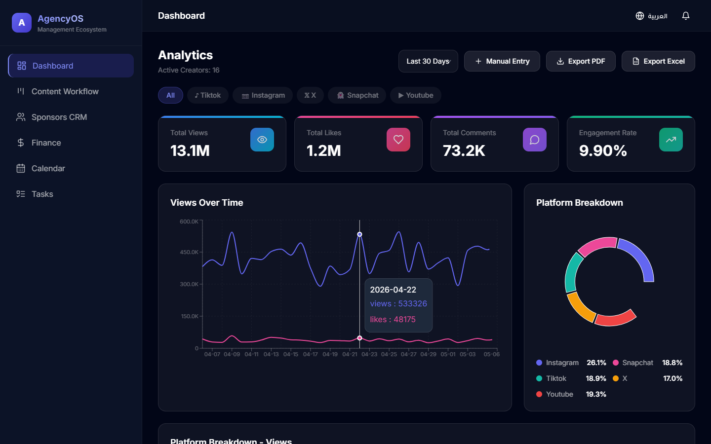
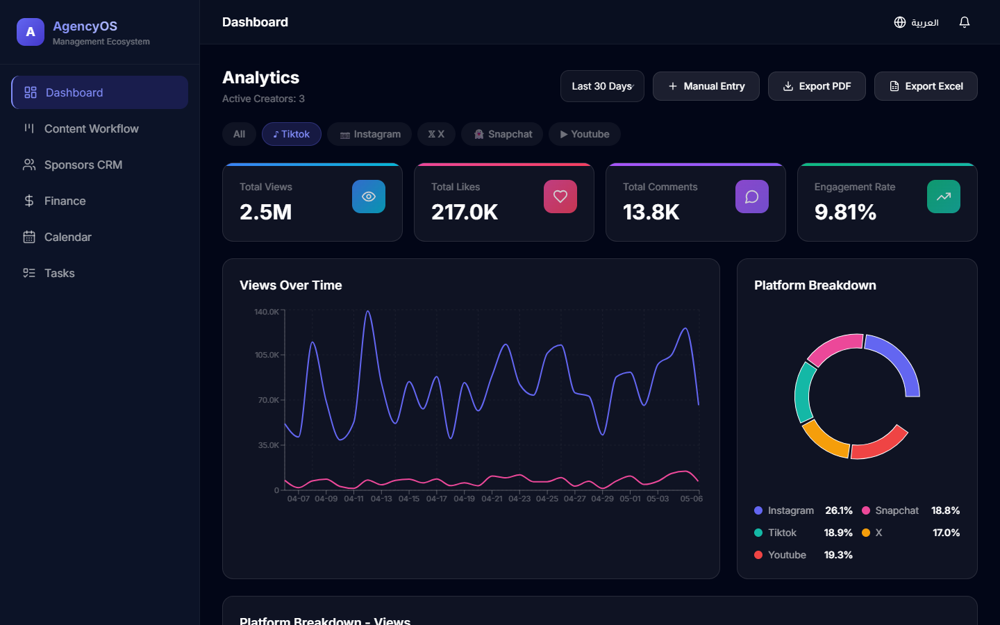
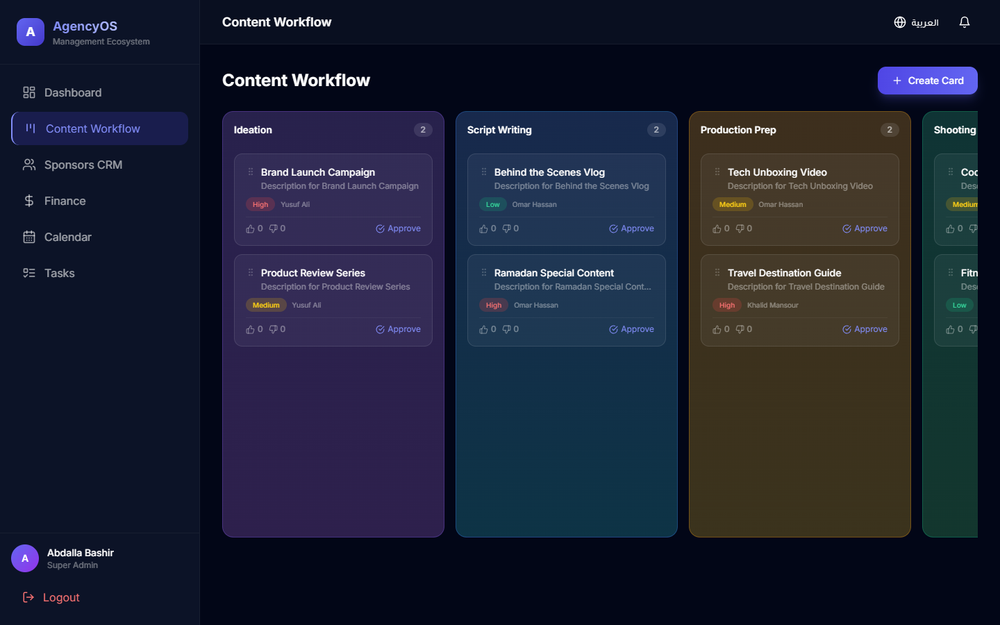
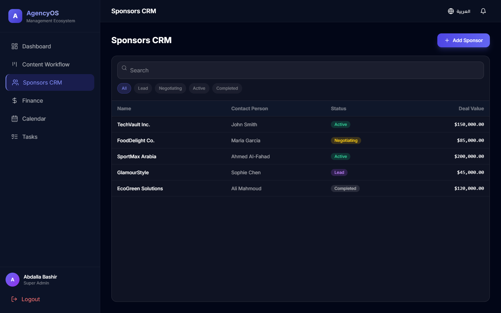
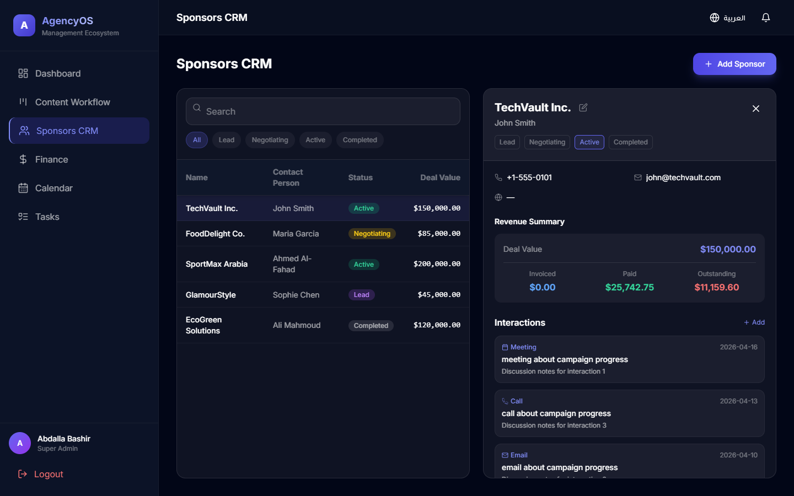
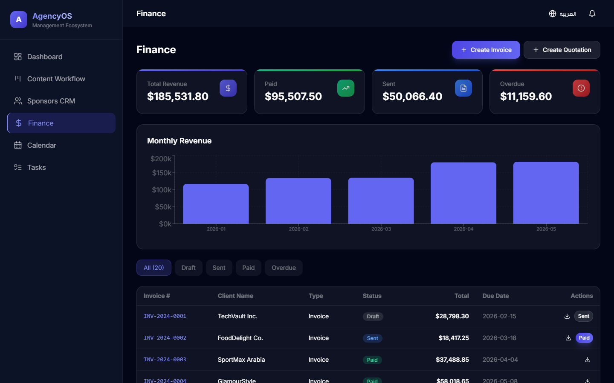
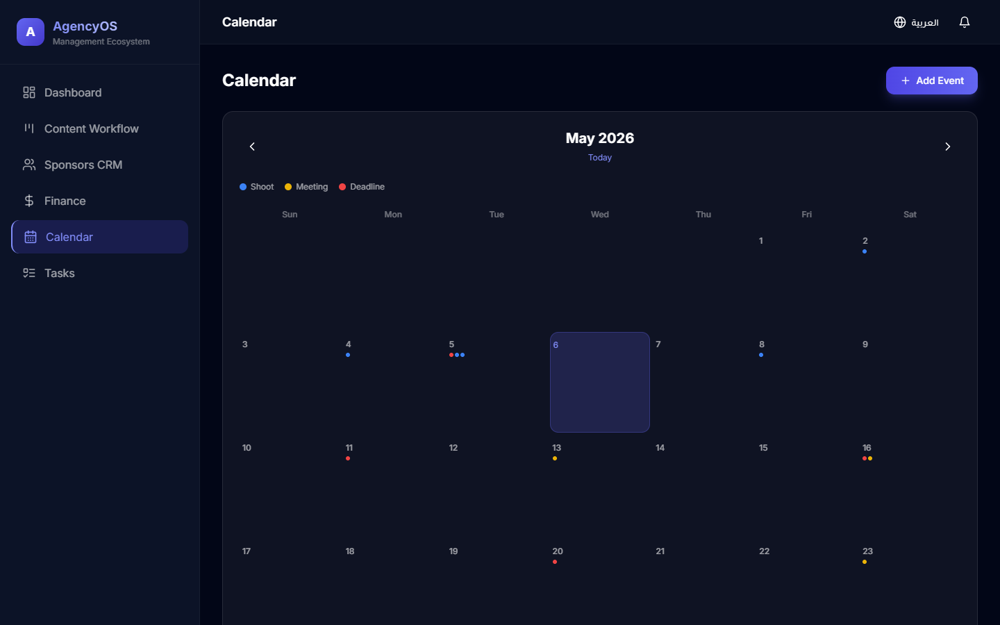
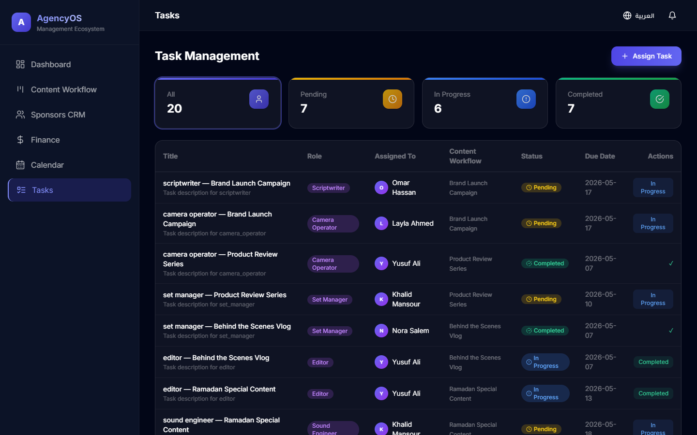
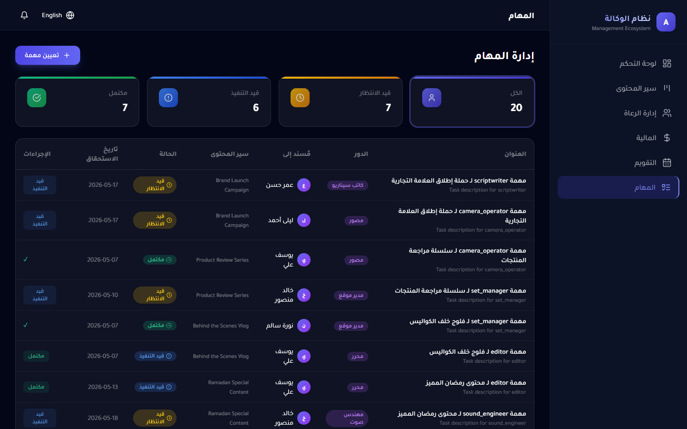

<div align="center">
  <h1>🚀 AgencyOS</h1>
  <p>A comprehensive full-stack agency management ecosystem for modern content creator agencies.</p>

  <p>
    
    
    
    
    
  </p>
</div>

---

## 📖 Overview

**AgencyOS** is a powerful, full-stack agency management ecosystem built specifically for content creator agencies. It centralizes essential business operations—from high-level analytics and complex content workflows to sponsor tracking and invoice generation. By unifying these disjointed processes into a single elegant platform, AgencyOS eliminates friction and empowers teams to focus on scaling their digital footprint and maximizing revenue.

## 📸 Screenshots


*Analytics Dashboard: Multi-platform data aggregation & platform breakdown*


*Analytics Dashboard: Interactive platform filtering*


*Content Workflow: Interactive Kanban board with voting system*


*Sponsors CRM: Comprehensive sponsor profiles and lists*


*Sponsors CRM: Detailed sponsor profiles, interaction logs, & revenue tracking*


*Finance: Complete invoicing engine, PDF generation, and monthly revenue metrics*


*Calendar: Centralized content scheduling*


*Task Management: Production roles and statuses*


*Global Ready: Full RTL Arabic support natively integrated*

## ✨ Features

- 📊 **Analytics Dashboard**  
  Multi-platform data aggregation, robust tag filtering, and beautiful data visualization via donut and line charts. Easily export dynamic reports to PDF or Excel.

- 📝 **Content Workflow**  
  An interactive Kanban board with a built-in voting system. Approving a card automatically generates and assigns parallel tasks for the production team.

- 🤝 **Sponsors CRM**  
  Comprehensive sponsor profiles featuring interaction logs (track meetings, emails, and calls) alongside real-time financial tracking directly linked to invoices.

- 💰 **Finance**  
  A complete invoicing engine supporting invoice and quotation generation, automated PDF exports, and visual revenue charts to track monthly income and overdue balances.

- 📅 **Calendar**  
  A centralized schedule for the entire agency, seamlessly auto-linked to Kanban shoot dates and important deadlines.

- 👥 **Task Management**  
  Granular role assignment per content piece (e.g., scriptwriter, editor, camera operator) to ensure accountability across all production stages.

## 🛠 Tech Stack

### Frontend
- **React** - Component-based architecture for an interactive UI
- **Tailwind CSS** - Rapid styling with a modern glassmorphism aesthetic
- **Chart.js / Recharts** - Dynamic, responsive data visualization

### Backend
- **Node.js & Express** - Fast, lightweight, and scalable REST API
- **SQLite** - Self-contained, zero-configuration SQL database engine
- **JWT Auth** - Secure, stateless JSON Web Token authentication

## 🚀 Getting Started

### Prerequisites
- **Node.js** (v18 or higher)
- **npm** (v9 or higher)

### 1. Clone the repository
```bash
git clone https://github.com/bashirAI-lab/-AgencyOS-.git
cd -AgencyOS-
```

### 2. Install dependencies
Install dependencies for the root, frontend, and backend simultaneously:
```bash
npm run install:all
```

### 3. Environment Setup
Copy the example environment file and configure it:
```bash
cd server
cp .env.example .env
```

### 4. Run Database Seed
Initialize the SQLite database with placeholder data (users, sponsors, invoices, etc.):
```bash
# From the root directory
npm run seed
```

### 5. Start Development Server
Start both the React frontend and Express backend concurrently:
```bash
# From the root directory
npm run dev
```
> The frontend will be available at `http://localhost:3000` and the backend API at `http://localhost:5000`.

## ⚙️ Environment Variables

The backend requires the following environment variables in `server/.env`:

| Variable | Description | Example Value |
| --- | --- | --- |
| `PORT` | The port the Express backend runs on | `5000` |
| `JWT_SECRET` | Secret key used to sign and verify JWTs | `super_secret_agency_key_2026` |
| `DB_PATH` | Path to the SQLite database file | `./db/agencyos.db` |

## 🔌 API Overview

| Route Group | Purpose |
| --- | --- |
| `/api/auth` | User authentication, login, and token verification |
| `/api/analytics` | Aggregated dashboard metrics, creator statistics, and tags |
| `/api/kanban` | Workflow boards, card states, and voting mechanisms |
| `/api/sponsors` | CRM data, interactions, and financial tracking per client |
| `/api/finance` | Invoice management, revenue summaries, and PDF generation |
| `/api/calendar` | Agency-wide event tracking and scheduling |
| `/api/tasks` | Content production tasks and role assignments |

## 📂 Folder Structure

```text
agencyos/
├── client/                 # React Frontend
│   ├── public/             # Static assets
│   ├── src/
│   │   ├── components/     # Reusable UI components
│   │   ├── context/        # React Context (Auth, Language, Theme)
│   │   ├── pages/          # Main application views (Dashboard, Kanban, etc.)
│   │   ├── i18n/           # Internationalization (en.json, ar.json)
│   │   ├── api.js          # API client wrappers
│   │   └── index.css       # Tailwind directives & global styles
│   └── package.json
├── server/                 # Express Backend
│   ├── db/                 # SQLite database & seeding scripts
│   ├── middleware/         # JWT auth & role validation
│   ├── routes/             # API route controllers
│   ├── uploads/            # Temporary file storage (e.g., PDFs)
│   ├── server.js           # Main Express entry point
│   └── package.json
├── package.json            # Root workspace configurations
└── README.md
```

## 📄 License

This project is licensed under the MIT License.
